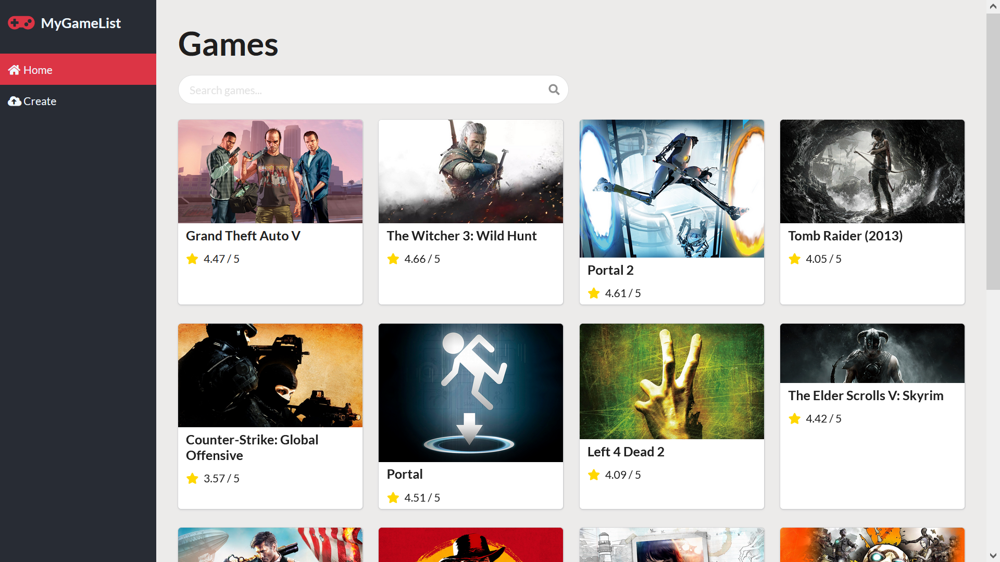
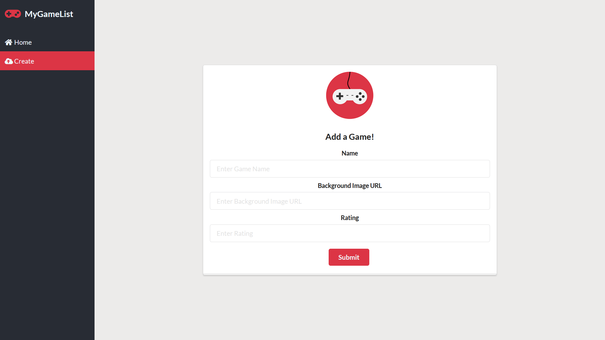

# MyGameList
A single-page application showcasing a database of video games.

## Features
* On the home page, enter a query into the search bar to find a specific game
* On the create page, add new games to the database by providing details such as name, a background image url, and a rating

## Installation Instructions
Download the backend repo from [backend link](https://github.com/aadilahmed/phase-2-react-project-json-server). 
Run the command `npm install` then `npm run dev` in the backend directory to start the backend server. Run the command `npm install` then `npm start` in the frontend directory. Open http://localhost:3000 to view the application in your browser.

## Screenshots

## Contributing
Pull requests are welcome. For major changes, please open an issue first to discuss what you would like to change.

## License
[MIT](https://choosealicense.com/licenses/mit/)

## Backend Code Github Repository
https://github.com/aadilahmed/phase-2-react-project-json-server
